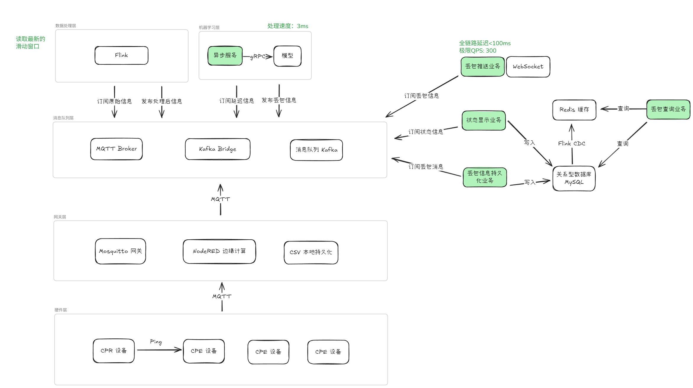

## 一个CPE丢包检测与配置平台
- 丢包预测模型相关工作: [Packet Loss Event Classification](https://github.com/AnIceCould/Proj-of-Polimi/tree/main/Network%20Measurement%20and%20Data%20Analysis%20Lab/H_Packet%20Loss%20Event%20Classification)

1. 多个 CPE 设备产生流量数据和自身状态数据。发送 MQTT 到 Mosquitto 网关。
2. 在网关处使用 NodeRED 进行边缘计算，进行过滤和删除多余信息工作。
3. NodeRED 处理后再通过 MQTT 发送到 Kafka 服务器的网关，并投递给 Kafka 消息队列集群。
4. Flink 订阅原始信息，进行多算子流处理和滑动窗口计算后发布到处理后信息和状态信息。
5. 异步服务订阅处理后的延迟信息，通过异步gRPC调用负载均衡的 XGBoost 模型服务器，将返回结果发布到消息队列。
6. 丢包预测业务服务会订阅丢包信息，通过 WebSocket 同步给前端。并实时写入 Redis 缓存，定时批量写入 MySQL 数据库。
7. 状态管理业务服务会接收前端的指令修改  MySQL 数据库信息，如果不存在则查询 Redis ，若存在则返回等待，不存在则返回失败。
